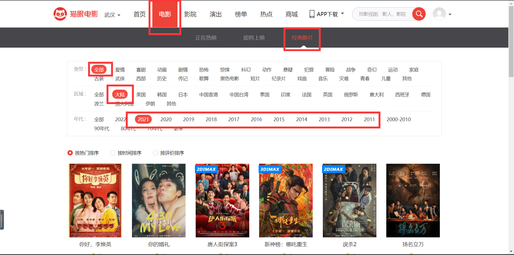

# 1 IMDB

## 1.1 数据来源

* IMDB：从这里获取电影信息，电影名称、类型、主演、时长、导演、编剧、出品、发行等

    > * url：https://www.imdb.com/title/tt7362036/，可获得：
    >
    >     1. 电影IMDB编号，例tt7362036
    >     2. 电影时长，例1h 57m
    >     3. 电影类型，例 Comedy · Drama
    >     4. 发行日期，
    >     5. 全球总票房，Gross worldwide
    >
    > * url2：url+"/fullcredits"，可获得：
    >
    >     1. 导演，例[Muye Wen](https://www.imdb.com/name/nm6337063/?ref_=ttfc_fc_dr1) 
    >     2. 编剧，
    >     3. 演员表
    >     4. 
    >
    > * url3：url+"/companycredits"，可获得：
    >
    >     1.  制作公司
    >     2. 发行公司
    >
    > * 某一人物的界面：
    >
    >     对于导演找Director部分，对于演员找Actor部分（除去TV Series）
    >
    >     ```pseudocode
    >     function processOnePerson(person , personType)
    >     // person = Person({
    >     	string name;
    >     	string personID;
    >     	Film[] actFilm;
    >     	Film[] directFilm;
    >     })
    >     
    >     return this Person's Total Boxoffice under personType
    >     ```
    >
    >     
    >
    > * 

* Boxofficemojo：获取票房信息

## 1.2 字段说明

| 特征           | 说明                                   | 举例 |
| -------------- | -------------------------------------- | ---- |
| 电影的累计票房 | 单位：元                               |      |
| 类型           | 每一类型电影的票房合计(11-21年)        |      |
| 时长           | 分钟                                   | 128  |
| 导演           | 该导演**执导**的电影票房合计，须是执导 |      |
| 编剧           | 与导演类似                             |      |
| 出品人         |                                        |      |
| 制片人         |                                        |      |
| 主演           |                                        |      |

## 1.3 pseudo code

### class

```python
class Film:
    string fileName      //电影名字
    string filmID        //电影的IMDB的ID
    string releaseDate   //上映时间
    int duration         //市场，单位：分钟
    string[] fimeType    //电影类型，先用列表存起来，之后再处理
    
    double grossBoxoffice //总票房
    double totalActorBox  //所有主演的票房总收入
    double totalDirectBox //所有导演的票房总收入
    double totalWriteBox  //所有编剧的票房总收入
    double totalProducBox //所有发行人的票房总收入

       
    Person[] actorList    //主演列表
    Person[] directList   //导演列表
    Person[] writerList   //编剧列表
    Person[] producerList //发行人列表
    
    Firm[] productionFirm //制作公司
    Firm[] distributeFirm //发行公司
    
class Person:
	string personName
    string personID
    
    double totalActorFilmBox
    double totalDirectFilmBox
    double totalWriteFilmBox
    double totalProduceFileBox
    
    Film[] actorFilm   //参演的电影
    Film[] directFilm  //导演的电影
    Film[] writeFilm   //编剧的电影
    Film[] produceFilm //发行的电影
    
class Firm:
    string firmName
    string firmID
    
    double totalProdFilmBox
    double totalDistribBox
    
    Film[] productFilm
    Film[] distributeFilm
    
```


# 2 猫眼Version //TODO

## 1. 电影来源

所有电影来自于猫眼，如下图所示（经典影片、全部、大陆、年份爬取2011至2021年）



URL：https://www.maoyan.com/films?sourceId=2&yearId=16&showType=3&sortId=1

| URL字段  | 含义           | 说明                           |
| -------- | -------------- | ------------------------------ |
| sourceId | 表示区域       | 此处填写2，表示大陆            |
| yearId   | 表示年份       | 此处为16(对应21)——6(对应11)    |
| showType | 表示上映类型   | 此处为3，表示已上映            |
| offset   | 表示第几张的表 | 0：第一面；30：第二面；60..... |

## 2. 字段

| 特征           | 说明                                   | 举例       |
| -------------- | -------------------------------------- | ---------- |
| 电影的累计票房 | 单位：元                               | 5413000000 |
| 类型           | 每一类型电影的票房合计(11-21年)        |            |
| 时长           | 分钟                                   | 128        |
| 导演           | 该导演**执导**的电影票房合计，须是执导 |            |
| 编剧           | 与导演类似                             |            |
| 出品人         |                                        |            |
| 制片人         |                                        |            |

